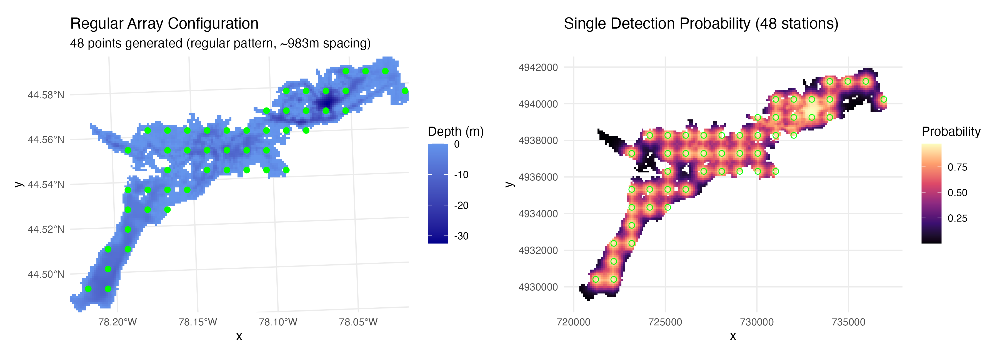
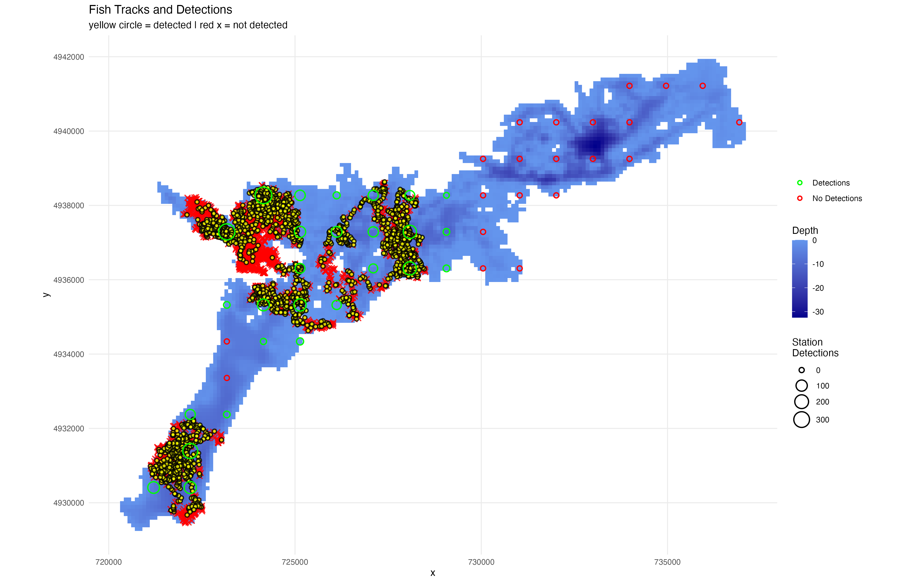
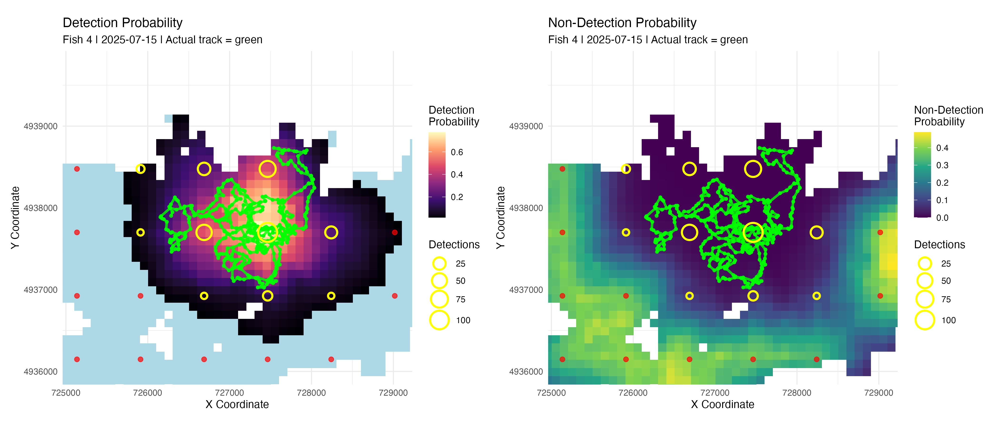
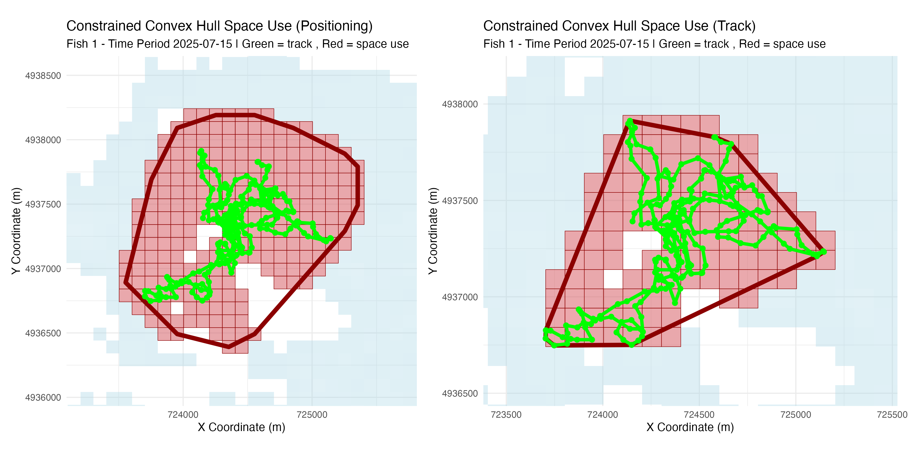
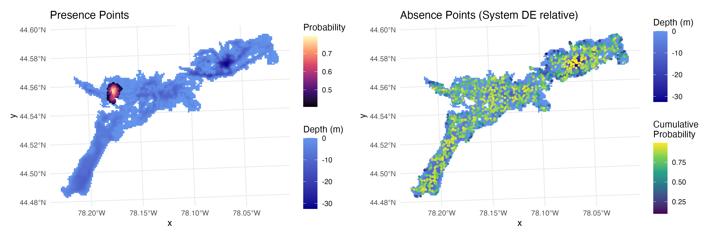
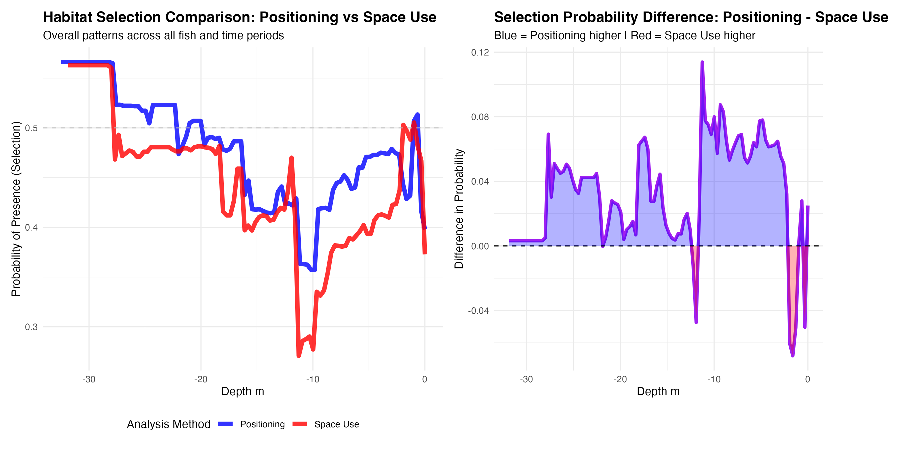

# <span style="font-family: 'Segoe UI', 'Helvetica Neue', Arial, sans-serif; font-weight: 300; letter-spacing: 1px;">position</span><span style="font-family: 'Segoe UI', 'Helvetica Neue', Arial, sans-serif; font-weight: 700; color: #2c5aa0;">R</span> 

[](https://www.gnu.org/licenses/gpl-3.0)

**Tools for Analyzing Acoustic Telemetry Data - Positioning, Simulation, & Array Design**

`positionR` provides comprehensive tools for acoustic telemetry array design, fish movement simulation, animal positioning using Weighted Average Detection Efficiency (WADE) methodology, and point generation for habitat selection studies that integrate sampling regions. One major advancement is the integration of receiver detection efficiency models into fish positioning, array performance, and habitat selection. This integrated analysis ecosystem provides powerful methodology to assess positioning and habitat selection model performance with simulations to inform best practices for assessing these metrics with real world aquatic animal tracking studies. 

## 📚 Tutorials

### 📡 <a href="https://jakebrownscombe.github.io/positionR/articles/Array_Design_Simulation.html" target="_blank">Array Design & Simulation Tutorial</a>
Optimize receiver arrays and simulate realistic fish movements for system evaluation

### 📊 <a href="https://jakebrownscombe.github.io/positionR/articles/WADE_Simulation.html" target="_blank">WADE Positioning Tutorial</a> 
Complete workflow for fish positioning using WADE methodology with simulated data

### 🐟 <a href="vignettes/WADE_Field_App.R" target="_blank">WADE Field Application Tutorial</a>
Application of WADE positioning to real acoustic telemetry data

### 🔬 <a href="vignettes/Simulation_Advanced.R" target="_blank">Advanced Simulation Tutorial</a>
Advanced movement model simulations using species specific parameters (beta)


## Installation

Install the development version from GitHub:

```r
# Install devtools if you haven't already
install.packages("devtools")

# Install positionR with vignettes
devtools::install_github("jakebrownscombe/positionR", build_vignettes = TRUE)
```

## Features

### 🎯 **Array Design & Optimization**
- Multiple receiver placement strategies (regular, spaced, random patterns)
- Distance-based detection efficiency model generation with depth integration
- System-wide detection coverage analysis
- Array performance evaluation and optimization



### 🐟 **Movement Simulation**
- Generate movement tracks with correlated random walk models
- Produce detection patterns from tracks based on detection efficiency
- Compare positioning and habitat selection to true track locations for optimization
- Advanced movement models integrate behavioral states relative to species tendencies and environmental conditions (e.g., temperature). Extensible framework for users to build upon



### 📍 **WADE Positioning**
- Weighted Average Detection Efficiency animal positioning uses detection efficiency information to position animals
- Flexible detection model applications and temporal aggregation (e.g., hourly, daily)
- Analytical tools for calculating home ranges and habitat selection from WADE positions
- Simulations can inform best practices for positioning, depending on endpoints 
- Field data integration for real acoustic telemetry datasets



### 📊 **Space Use Analysis**
- Estimate scale of space use (home ranges)
- Multiple space use estimation methods (convex hulls, grid cells)



### 🎯 **Point Generation for Habitat Selection**
- Multiple approaches to generate space use points based on positioning thresholds and probabilities
- Generate absences in areas being sampled by the telemetry system



### 🌊 **Space Use & Habitat Analysis**
- Habitat selection analysis with presence/absence modeling
- Comparative analysis between positioning estimates and known tracks




### 🔍 **Visualization & Analysis**
- Comprehensive plotting functions for all analysis types
- Flexible space use visualization
- Detection performance metrics and summaries
- Publication-ready figures and plots


## Quick Start:
The vignettes folder has a range of R worksheets providing example code for getting started using the package, the straight .R worksheets (e.g., Array_Design_Simulation.R) provide example workflows. The package is designed to allow for integration of user data throughout (e.g., using an existing receiver array, a real world detection range model, and real animal detection data). 

## Core Function Categories

### 🎯 **Array Generation**
- `generate_regular_points()` - Specific number of regularly spaced receivers
- `generate_spaced_points()` - Receivers with defined minimum spacing  
- `generate_random_points()` - Randomly distributed receivers

### 📡 **Detection Modeling**  
- `create_logistic_curve_depth()` - Distance-depth detection efficiency models
- `calculate_station_distances()` - Cost-weighted distance calculations
- `calculate_detection_system()` - System-wide detection probability surfaces

### 🐟 **Movement & Positioning**
- `simulate_fish_tracks()` - Behavioral movement simulation with species parameters
- `prepare_detection_data_for_wade()` - Process field detection data
- `calculate_fish_positions()` - WADE positioning algorithm

### 📈 **Space Use Analysis**
- `calculate_space_use()` - Multiple space use estimation methods
- `generate_random_points_in_space_use()` - Point sampling from space use areas
- `generate_space_use_absences()` - Generate absence points for habitat analysis
- `analyze_comparative_habitat_selection()` - Compare positioning vs tracking data

### 🎨 **Visualization**
- `plot_fish_tracks()` - Movement paths with detection events
- `plot_fish_positions()` - WADE positioning probability surfaces  
- `plot_space_use()` - Space use area visualizations
- `plot_behavioral_states()` - Behavioral state time series
- `plot_depth_selection()` - Habitat selection analysis plots

### 📊 **Analysis**
- `analyze_detection_performance()` - Detection system performance metrics
- `analyze_behavioral_temperature()` - Temperature-behavior interactions
- `compare_space_use_thresholds()` - Space use method comparisons

## Included Datasets

- `depth_raster` - Example bathymetry raster for system testing
- `stoney_fish_detections` - Real walleye detection data from Stoney Lake
- `stoney_rx_deploy` - Receiver deployment metadata
- `daily_temperature` - Daily water temperature data for behavioral modeling

## 📚 Tutorials & Vignettes

Comprehensive step-by-step tutorials demonstrate the full capabilities of positionR:

### 🐟 **WADE Positioning Tutorial**
**Complete workflow for fish positioning using WADE methodology**

Learn how to apply WADE positioning using simulated acoustic telemetry data, including detection data preparation, model fitting, positioning calculations, and space use analysis. Covers comparative analysis between the positioning method and simulated track data, which is useful for assessing system performance or refining algorithm settings for real world applications.

```r
vignette("WADE_Simulation", package = "positionR")
```

### 📡 **Array Design & Movement Simulation** 
**Optimize receiver arrays and simulate realistic fish movements**

Design effective receiver arrays using multiple placement strategies, model detection efficiency based on environmental conditions, simulate realistic fish movements, and evaluate system performance before deployment or post hoc. Includes presence-absence point generation useful for habitat selection analysis.

```r
vignette("Array_Design_Simulation", package = "positionR")
```

### 🔍 **Browse All Tutorials**
```r
browseVignettes("positionR")
```

**Online Documentation**: Visit our [package website](https://jakebrownscombe.github.io/positionR) for enhanced tutorials with interactive examples and detailed methodology explanations.

## Key Applications

- **🔬 Array Design**: Optimize receiver placement for detection coverage
- **📍 Animal Positioning**: Locate animals using WADE methodology  
- **🏠 Habitat Selection**: Analyze space use and habitat preferences
- **🌡️ Behavioral Ecology**: Study temperature-dependent movement patterns
- **📊 System Evaluation**: Assess performance of existing telemetry arrays
- **🎯 Simulation Studies**: Test scenarios and validate methodologies

## Methodology: WADE Positioning

The Weighted Average Detection Efficiency (WADE) methodology provides probabilistic animal positioning by:

1. **Detection Integration**: Combining detection events with receiver-specific detection probabilities
2. **Non-detection Integration**: Incorporating information from receivers that should have detected the animal but didn't
3. **Temporal Aggregation**: Integrating data across user-defined time periods  
4. **Spatial Weighting**: Weighting positions by detection efficiency and detection frequency
5. **Uncertainty Quantification**: Providing probability surfaces rather than point estimates

## Dependencies

Key dependencies include:

- **Spatial**: `raster`, `sf`, `sp`, `gdistance` - spatial data handling and analysis
- **Visualization**: `ggplot2`, `ggridges`, `scales` - publication-quality plots
- **Data**: `dplyr`, `tidyr`, `lubridate` - data manipulation and processing  
- **Movement**: `circular`, `FNN` - movement modeling and nearest neighbor calculations
- **Analysis**: `randomForest` - habitat selection modeling

## Citation

If you use positionR in your research, please cite:

```
Brownscombe, J.W. (2025). positionR: Weighted Average Detection Efficiency (WADE) 
Positioning for Acoustic Telemetry. R package version 1.0.0. 
https://github.com/jakebrownscombe/positionR
```

## Contributing

Contributions are welcome! Please:

1. Fork the repository
2. Create a feature branch (`git checkout -b feature/new-feature`)
3. Commit changes (`git commit -am 'Add new feature'`)
4. Push to branch (`git push origin feature/new-feature`)  
5. Create a Pull Request

## License

This project is licensed under the GPL-3 License - see the [LICENSE](LICENSE) file for details.

## Contact & Support

- **Author**: Dr. Jacob Brownscombe  
- **Email**: jakebrownscombe@gmail.com
- **GitHub**: [@jakebrownscombe](https://github.com/jakebrownscombe)
- **Issues**: [Report bugs or request features](https://github.com/jakebrownscombe/positionR/issues)
